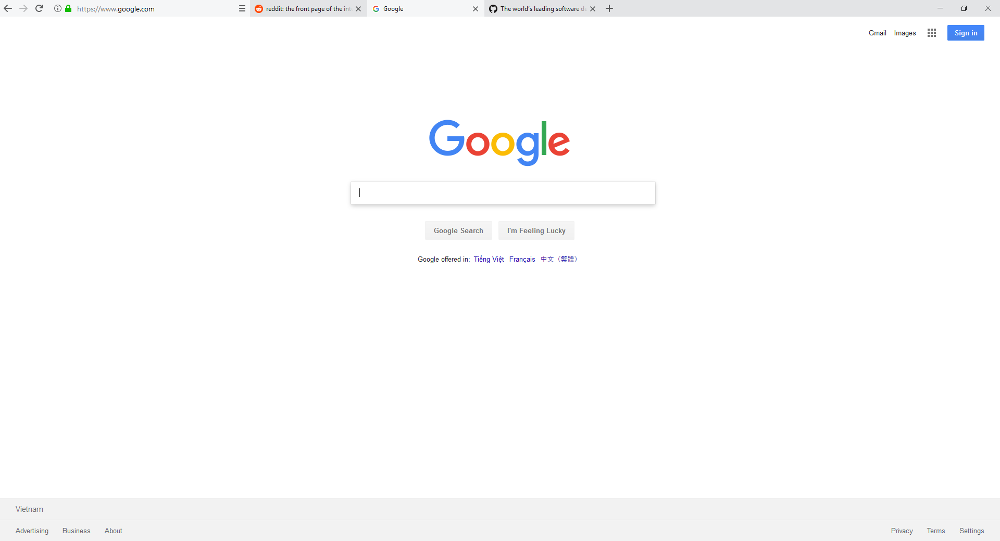
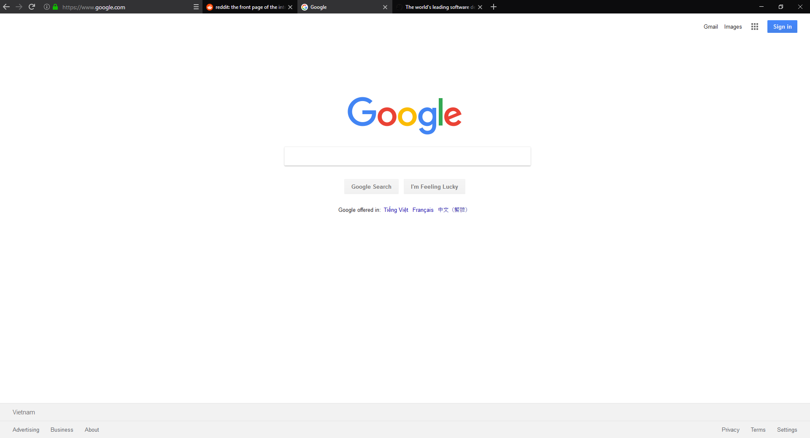
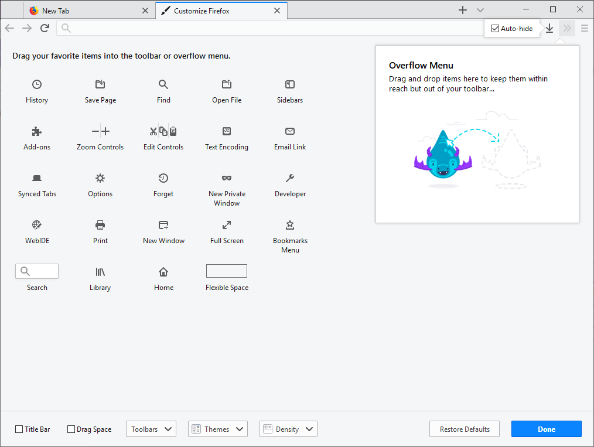

# One-line Firefox

## Screenshots

## Instructions

- Use with compact density, auto-hide downloads button, remove all flexible space and unnecessary items.

- In Firefox, open _`about:support`_, click on **Open Folder**.

- Create a sub-folder named `chrome`.

- Put this [`userChrome.css`](https://raw.githubusercontent.com/khuedoan98/one-line-firefox/master/userChrome.css) into that folder (you can download this file by right-click and select _Save link as..._).

- Restart Firefox

Based on original layout by /u/Herkt and /u/bleeps__:

https://www.reddit.com/r/FirefoxCSS/comments/7eazix/my_attempt_at_a_oneline_interface/

https://www.reddit.com/r/FirefoxCSS/comments/7ignsk/oneline_flat_interface_dark_light/
