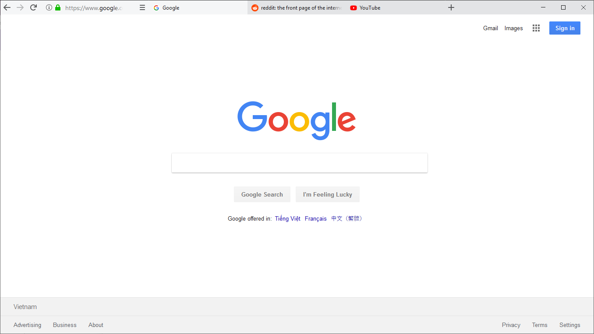
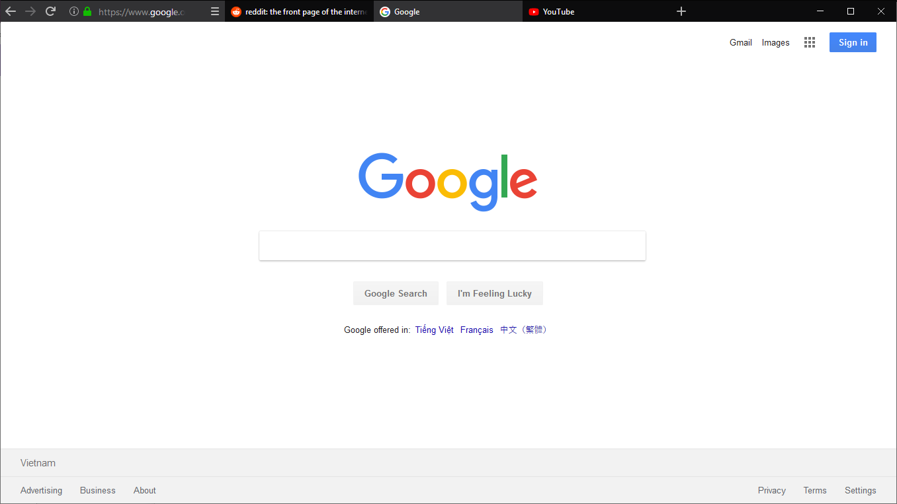

# One-line Firefox

## Screenshots

## Instructions

- Use with compact density, auto-hide downloads button, remove all flexible space and unnecessary items:

- Open [about:support](about:support), click on `Open Folder` in Profile Folder

- Create a sub-folder named `chrome`.
- Put this `userChrome.css` into that folder.

- Restart Firefox

Based on original layout by /u/Herkt and /u/bleeps__

https://www.reddit.com/r/FirefoxCSS/comments/7eazix/my_attempt_at_a_oneline_interface/

https://www.reddit.com/r/FirefoxCSS/comments/7ignsk/oneline_flat_interface_dark_light/
